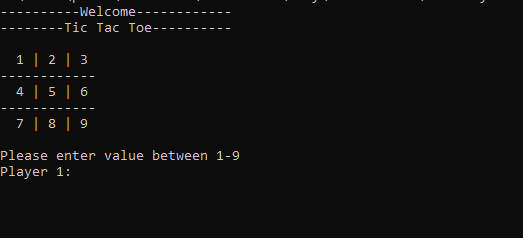
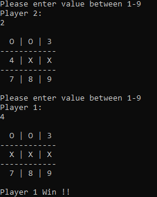
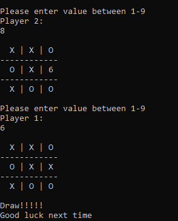
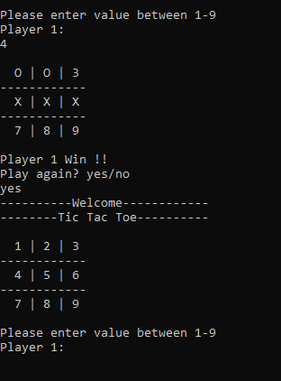

# Tic Tac Toe Project

Tic-Tac-Toe Game Application In Ruby

> In this project, it is assigned for us to create a Tic Tac Toe game using only Ruby to increase our knowledge on the OOP concepts. 
This project was split in 4 milestones, which were:
- Setting up the project
- Designing the user interface
- Creating the game logic
- Writing the game instructions

> The main goal of this project is to asure I master the methods ruby provides and to learn how to replicate them using basic coding knowledge.
## Live Demo
[Live Demo Link](https://repl.it/@pastorp3/tic-tac-toe#README.md)

## Built With
- Ruby
- Rubocop

## Prerequisites

- Browser (Google Chrome, Mozilla Firefox, Safari or any other browser)

## Setup
- Open Terminal

- Run git clone https://github.com/happiguru/tic-tac-toe/tree/game_logic
- Run `cd tic-tac-toe`
- Run `ruby bin/main`

## Game instructions
  The player has the option to play or to exit. If the player decides to play, these steps follow:
- Player one is the symbol 'X' and player two is the symbol 'O'

- A 3x3 grid is displayed on the terminal and the first player chooses a number to place his symbol on that number's position
- The players take turns in order to try to make an uninterrupted row, column or diagonal.

- The player which does that first wins!

- If all spaces are chosen and there is no winner, it is considered a draw

- Once the game finish, the players have the option to restart game or exit

- Have fun!

## Authors

👤 **Stanley Enow Lekunze**

- Github: [@happiguru](https://github.com/happiguru)
- Twitter: [@Lekunze_Nley](https://twitter.com/Lekunze_Nley)
- Linkedin: [lekunze-nley](https://www.linkedin.com/in/lekunze-nley/)

👤 **José Pedraza**

- Github: [@pastorp3](https://github.com/pastorp3)
- Twitter: [@jose_pastorp3](https://twitter.com/jose_pastorp3)
- Linkedin: [linkedin](https://www.linkedin.com/in/jos%C3%A9-pedraza-acevedo-ab700a1a9/)

## 🤝 Contributing

Contributions, issues and feature requests are welcome!

Feel free to check the [issues page](https://github.com/happiguru/tic-tac-toe/issues).

## Show your support

Give a ⭐️ if you like this project!

## Acknowledgments

- Microverse
- GitHub
- TheOdinProject
- Ruby

## 📝 License

This project is [MIT](lic.url) licensed.
